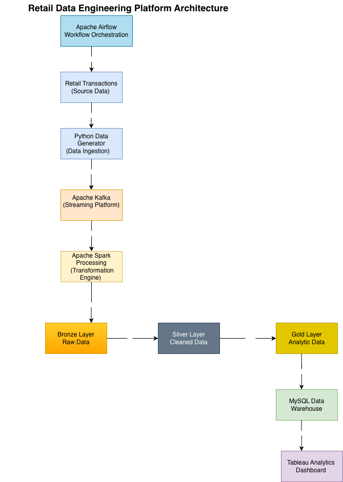
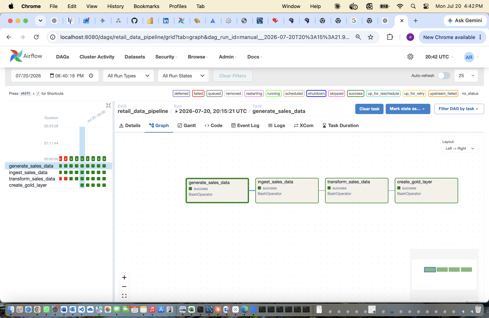

# Retail Data Engineering Platform

An end-to-end retail data engineering pipeline that processes transactional data using Python, Apache Kafka, Apache Spark, Apache Airflow, MySQL, and Tableau.

The project demonstrates a modern data engineering workflow from data ingestion to analytics visualization.

---

## 1. Project Overview

This project simulates a retail analytics platform that:

- Generates retail transaction data
- Ingests streaming data using Kafka
- Processes and transforms data using Spark
- Implements Bronze, Silver, and Gold data layers
- Orchestrates workflows using Apache Airflow
- Stores analytical data in MySQL
- Creates business dashboards using Tableau

---

## 2. Architecture

The following diagram represents the end-to-end retail data engineering pipeline:

               
---
## 3. Airflow Pipeline Orchestration

Apache Airflow orchestrates the complete retail data engineering workflow by executing each stage of the pipeline in sequence.

The DAG automates the following tasks:

- Generate retail transaction data
- Publish transactions to Apache Kafka
- Process streaming data using Apache Spark
- Build Silver layer datasets
- Generate Gold layer analytical datasets

The following Airflow DAG shows a successful end-to-end pipeline execution:



---

## 4. Data Processing

The data processing pipeline follows a structured ETL workflow to transform raw retail transactions into analytics-ready datasets.

### Data Flow

#### 1. Data Generation

- Python-based data generator creates retail transaction records.
- Generates customer, product, transaction, and sales information.
- Stores raw transaction data in CSV format.

#### 2. Data Ingestion

- Apache Kafka is used for real-time transaction streaming.
- Producers send transaction events into Kafka topics.

#### 3. Data Transformation

Apache Spark processes incoming transaction data and performs:

- Data cleaning
- Data validation
- Data transformation
- Aggregations

#### 4. Data Storage

Processed data is organized using the **Medallion Architecture**:

**Bronze Layer**
- Stores raw ingested data.

**Silver Layer**
- Stores cleaned and transformed data.

**Gold Layer**
- Stores business-ready analytical datasets.

#### 5. Analytics

- MySQL Data Warehouse stores analytical tables.
- Tableau connects to the warehouse to create business dashboards.

---

## 5. Technology Stack

| Category | Technologies |
|----------|--------------|
| Programming Language | Python |
| Database | MySQL |
| Streaming | Apache Kafka |
| Data Processing | Apache Spark (PySpark) |
| Workflow Orchestration | Apache Airflow |
| Data Visualization | Tableau |
| Containerization | Docker |
| Version Control | Git & GitHub |
| Development Environment | VS Code |

## 6. Data Engineering Pipeline

The project follows an end-to-end retail data engineering workflow:

```text
Apache Airflow
        │
        ▼
Python Data Generator
        │
        ▼
Apache Kafka
        │
        ▼
Apache Spark
        │
        ▼
Bronze Layer
        │
        ▼
Silver Layer
        │
        ▼
Gold Layer
        │
        ▼
MySQL Data Warehouse
        │
        ▼
Tableau Dashboard

The pipeline demonstrates data ingestion, real-time streaming, data transformation, storage, workflow orchestration, and business intelligence reporting.
```
---
## 7. Database Design

The analytical data is stored in a MySQL data warehouse.

**Database:** `retail_db`

**Table:** `sales_transactions`

| Column | Description |
|---|---|
| transaction_id | Unique transaction identifier |
| customer_id | Customer identifier |
| product_id | Product identifier |
| product_category | Product category |
| quantity | Quantity purchased |
| price | Unit price |
| total_amount | Total transaction amount |
| payment_method | Payment method |
| store_location | Store location |
| timestamp | Transaction timestamp |

---

## 8. Tableau Dashboard

The final analytics layer provides business insights through interactive Tableau dashboards connected to the MySQL data warehouse.

### Dashboard Preview


### Dashboard Components

#### Total Revenue KPI


#### Revenue by Product Category


#### Sales Trend Over Time


### Dashboard Insights

- Revenue performance analysis
- Product category analysis
- Sales trend analysis

---
## 9. How to Run the Project

### Clone Repository

```bash
git clone https://github.com/Anitharaj31/retail-data-engineering-platform.git

cd retail-data-engineering-platform
```

### Create Virtual Environment

```bash
python3 -m venv venv

source venv/bin/activate
```

### Install Dependencies

```bash
pip install -r requirements.txt
```

### Start Docker Services

Start Kafka and required services:

```bash
docker compose up -d
```

### Generate Retail Transaction Data

Run the data generator:

```bash
python src/data_generator.py
```

### Run Data Transformation Pipeline

Run Spark transformation:

```bash
python src/transformation/gold_layer.py
```

### Run Airflow Pipeline

Start Airflow webserver:

```bash
airflow webserver --port 8080
```

Start scheduler in another terminal:

```bash
airflow scheduler
```

The Airflow DAG orchestrates the retail data pipeline workflow.

---

## 10. Project Structure

```text
retail-data-engineering-platform

├── airflow
│   └── dags
│       └── retail_data_pipeline.py
│
├── dashboards
│   └── Tableau dashboards
│
├── data
│   ├── raw
│   ├── silver
│   └── gold
│
├── docker
│   └── Kafka containers
│
├── kafka
│   └── producer scripts
│
├── sql
│   └── SQL scripts
│
├── src
│   ├── ingestion
│   └── transformation
│
├── tests
│
├── requirements.txt
└── README.md
```
---

## 11. Future Enhancements

- Deploy the data pipeline on AWS Cloud
- Store raw and processed data using Amazon S3
- Use AWS Glue for serverless ETL processing
- Use Amazon Athena for querying data lake datasets
- Implement real-time monitoring and alerting
- Add data quality validation frameworks
- Add CI/CD pipeline using GitHub Actions

---

## 12. Key Skills Demonstrated

- Data Engineering Pipelines
- ETL Development
- Streaming Data Processing
- Data Warehousing
- Data Modeling
- Workflow Orchestration
- Business Intelligence Analytics
- Python Development
- SQL Development
- Apache Kafka
- Apache Spark
- Apache Airflow
- Tableau Dashboard Development
- Git & GitHub

---

## 13. Author

**Anitha Raj Bale**

Aspiring Data Engineer

* GitHub: https://github.com/Anitharaj31
* LinkedIn: https://www.linkedin.com/in/anitha-raj-bale-a8ba3117b/


