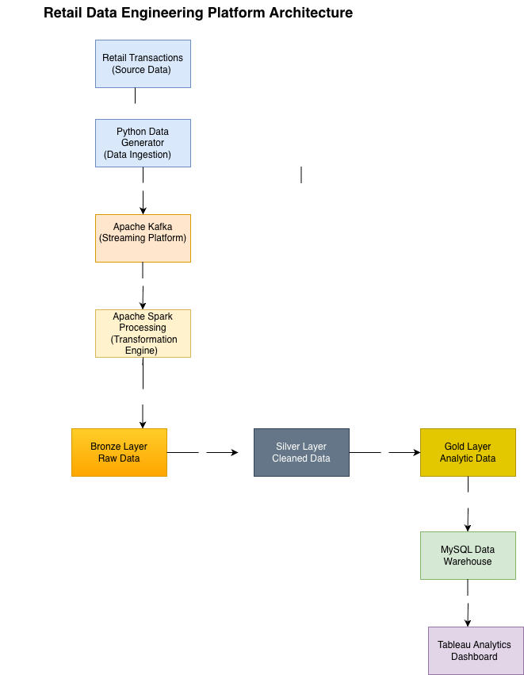

# Retail Data Engineering Platform

An end-to-end retail data engineering pipeline that processes transactional data using Python, Apache Kafka, Apache Spark, Apache Airflow, MySQL, and Tableau.

The project demonstrates a modern data engineering workflow from data ingestion to analytics visualization.

---

## Project Overview

This project simulates a retail analytics platform that:

- Generates retail transaction data
- Ingests streaming data using Kafka
- Processes and transforms data using Spark
- Implements Bronze, Silver, and Gold data layers
- Orchestrates workflows using Apache Airflow
- Stores analytical data in MySQL
- Creates business dashboards using Tableau

---

# Architecture

The following diagram represents the end-to-end retail data engineering pipeline:


               
---
# Technology Stack

## Programming
- Python
- SQL

## Data Engineering
- Apache Kafka
- Apache Spark
- Apache Airflow
- Docker

## Database
- MySQL

## Analytics & Visualization
- Tableau

## Development Tools
- Git
- GitHub
- VS Code

---

# Data Pipeline

## 1. Data Generation

Synthetic retail transaction data is generated using Python.

Sample attributes:

- Transaction ID
- Customer ID
- Product ID
- Product Category
- Amount
- Payment Method
- Store Location
- Timestamp

---

## 2. Data Streaming

Apache Kafka is used for real-time transaction ingestion.

Flow:
Python Producer
|
↓
Kafka Topic
|
↓
Spark Consumer


---

## 3. Data Processing

Apache Spark performs:

- Data cleaning
- Schema validation
- Transformation
- Aggregations

Data is organized into:

### Bronze Layer
Raw ingested data

### Silver Layer
Cleaned and transformed data

### Gold Layer
Business-ready analytical datasets

---

## 4. Workflow Orchestration

Apache Airflow manages pipeline execution.

Pipeline tasks:
Generate Data
↓
Transform Data
↓
Load Analytics Data

---

# Database Design

MySQL database:
retail_db
|
└── sales_transactions

Table columns:

| Column | Description |
|---|---|
| transaction_id | Transaction identifier |
| customer_id | Customer identifier |
| product_id | Product identifier |
| amount | Sales amount |
| timestamp | Transaction timestamp |
| transaction_time | Processed datetime |
| revenue_category | Revenue classification |

---
# Tableau Dashboard

The final analytics layer provides business insights through interactive dashboards.

## 5. Dashboard Preview


### Dashboard Components

#### Total Revenue KPI


#### Revenue by Product Category


#### Sales Trend Over Time


## 6. Dashboard Insights

- Revenue performance analysis
- Product category analysis
- Sales trend analysis

---
## 7. How to Run the Project

##  Clone Repository

```bash
git clone https://github.com/Anitharaj31/retail-data-engineering-platform.git

cd retail-data-engineering-platform
Create Virtual Environment
python3 -m venv venv
source venv/bin/activate

Install Dependencies
pip install -r requirements.txt

Start Docker Services
Start Kafka and required services:
docker compose up -d

Generate Retail Transaction Data
Run the data generator:
python src/data_generator.py

Run Data Transformation Pipeline
Run Spark transformation:
python src/transformation/gold_layer.py

Run Airflow Pipeline
Start Airflow webserver:
airflow webserver

Start scheduler in another terminal:
airflow scheduler

Trigger the DAG:
retail_data_pipeline

View Tableau Dashboard
Open the Tableau workbook from:
dashboards/

Connect Tableau to the MySQL Data Warehouse to view analytics.

Then save and push:

```bash
git add README.md
git commit -m "Add project run instructions"
git push


## 8. Project Structure
retail-data-engineering-platform

├── airflow
│ └── dags

├── dashboards
│ └── Tableau dashboards

├── data
│ ├── raw
│ ├── silver
│ └── gold

├── docker
│ └── Kafka containers
├── kafka
│ └── producer scripts

├── spark
│ └── Spark processing

├── sql
│ └── SQL scripts

├── src
│ ├── ingestion
│ └── transformation

├── tests

├── requirements.txt
└── README.md
---

## 9. Future Enhancements:

- Deploy the data pipeline on AWS Cloud
- Store raw and processed data using Amazon S3
- Use AWS Glue for serverless ETL processing
- Use Amazon Athena for querying data lake datasets
- Implement real-time monitoring and alerting
- Add data quality validation frameworks
- Add CI/CD pipeline using GitHub Actions
- Implement automated testing for data pipelines
- Add data governance and metadata management
- Scale Kafka and Spark processing for larger datasets


## 10. Key Skills Demonstrated:

Data Engineering Pipelines
ETL Development
Streaming Data Processing
Data Warehousing
Data Modeling
Workflow Orchestration
Business Intelligence Analytics
Python Development
SQL Development
Apache Kafka
Apache Spark
Apache Airflow
Tableau Dashboard Development
Git & GitHub


## 11. Author

Anitha Raj Bale
